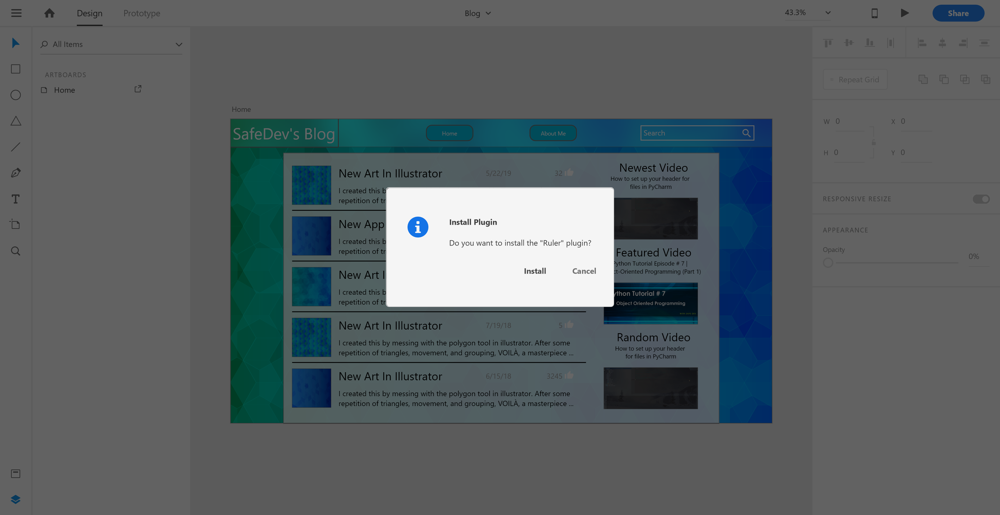
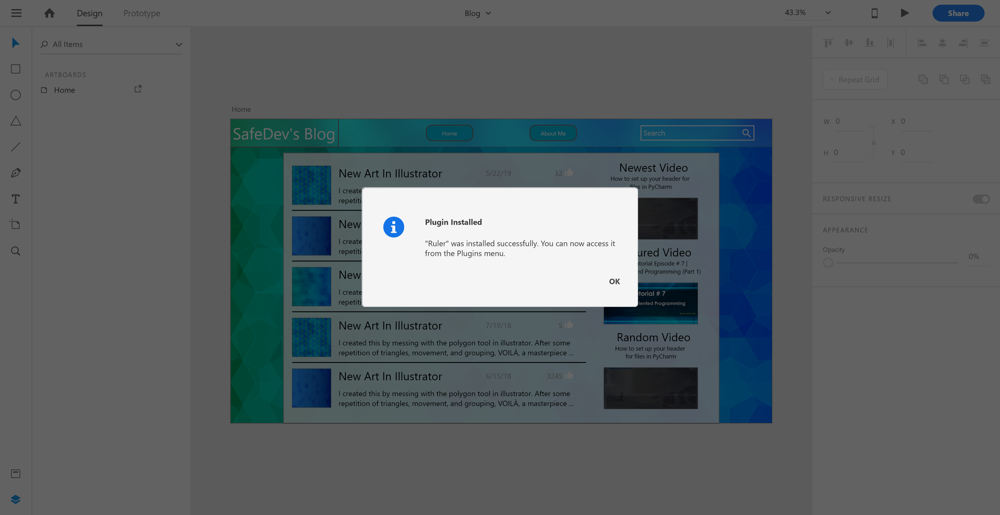

# __Adobe XD Ruler__

Adobe XD currently doesn't ship with a ruler of any kind and it doesn't seem like one will provided in the foreseeable future. This plugin bridges that gap and provides a versatile ruler to measure elements in an Artboard.

# Instructions to Download

1. Go to either Command Prompt on Windows or Terminal on Mac and type this command where you would like to install the plugin;

    `
    $ git clone https://github.com/ajidevelop/Adobe-XD-Ruler
    `

2. Double click the RulerPlugin.xdx file

You should see this message from Adobe XD asking to install.

3. Click yes and you should see this confirmation image.

## Update

1. To update the plugin go to either Command Prompt on Windows or Terminal on Mac and navigate to the directory of your download.

2. Type this command:

    `
    $ git pull
    `

<!-- 3. The plugin will update or you'll see -->
# How to Use

If no Artboard is chosen. The plugin will throw a warning message asking you to choose an Artboard. This video shows an example.

Currently the ruler hashes are only divided by the percentage of the page they take up. Rulers can also be made for specific elements on the page to see how much percentage they take in the container they occupy. Every long mark represents 10%, next in size represents 5%, and the smallest ones representing 1% each.

 If an element is locked, it needs to be unlocked to add a ruler for the element. Then you can lock it again after the rule has been added. Anther example in the following video.

# Upcoming Features

- ##### Custom Rulers in sizes
- ##### Scaling in pixels

Future updates coming soon.
